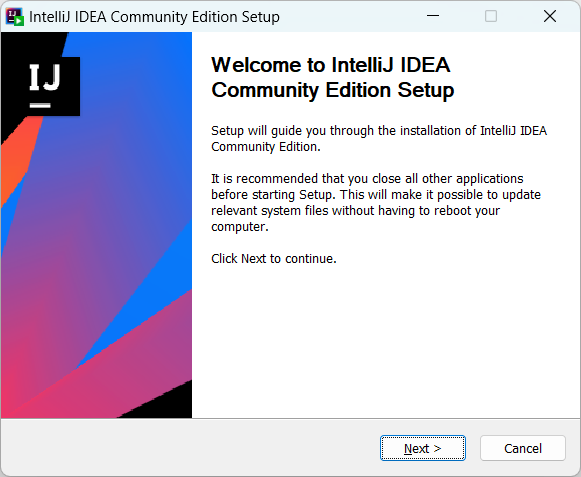
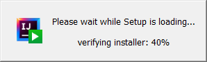
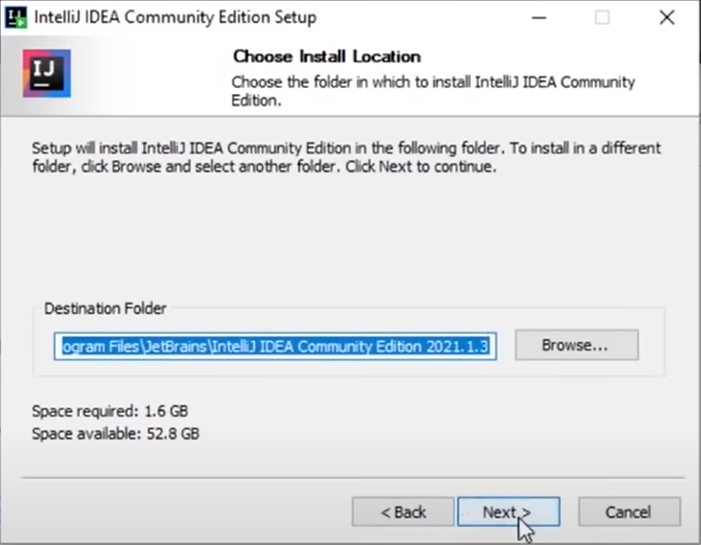
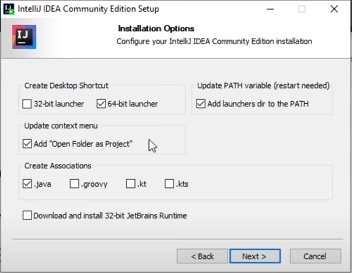
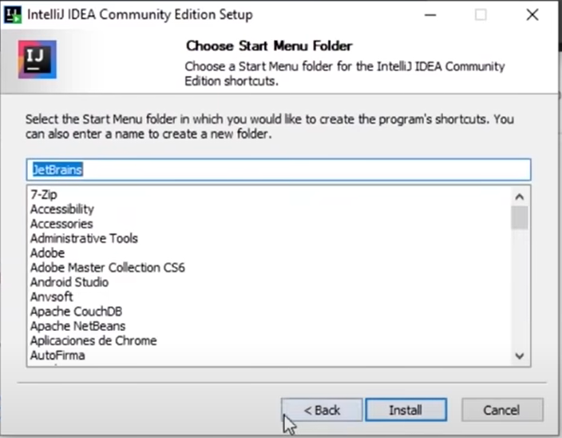
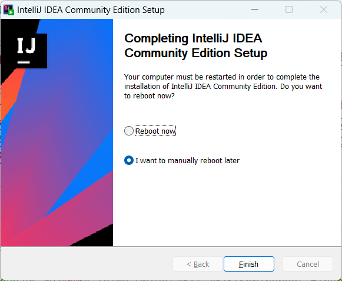

## **1.** Instalació IntelliJ IDEA  

### **IntelliJ IDEA** – the **Leading Java** and Kotlin IDE
#### The **IDE** that makes development a more productive and enjoyable experience

<svg  width="75" height="75" fill="none" viewBox="0 0 70 70"><defs><linearGradient id="__JETBRAINS_COM__LOGO_PREFIX__2" x1="5.174" x2="40.014" y1="39.889" y2="38.123" gradientUnits="userSpaceOnUse"><stop offset="0.091" stop-color="#FC801D"></stop><stop offset="0.231" stop-color="#B07F61"></stop><stop offset="0.409" stop-color="#577DB3"></stop><stop offset="0.533" stop-color="#1E7CE6"></stop><stop offset="0.593" stop-color="#087CFA"></stop></linearGradient><linearGradient id="__JETBRAINS_COM__LOGO_PREFIX__1" x1="61.991" x2="50.158" y1="36.915" y2="1.557" gradientUnits="userSpaceOnUse"><stop offset="0" stop-color="#FE2857"></stop><stop offset="0.078" stop-color="#CB3979"></stop><stop offset="0.16" stop-color="#9E4997"></stop><stop offset="0.247" stop-color="#7557B2"></stop><stop offset="0.339" stop-color="#5362C8"></stop><stop offset="0.436" stop-color="#386CDA"></stop><stop offset="0.541" stop-color="#2373E8"></stop><stop offset="0.658" stop-color="#1478F2"></stop><stop offset="0.794" stop-color="#0B7BF8"></stop><stop offset="1" stop-color="#087CFA"></stop></linearGradient><linearGradient id="__JETBRAINS_COM__LOGO_PREFIX__0" x1="10.066" x2="53.876" y1="16.495" y2="88.96" gradientUnits="userSpaceOnUse"><stop offset="0" stop-color="#FE2857"></stop><stop offset="0.08" stop-color="#FE295F"></stop><stop offset="0.206" stop-color="#FF2D76"></stop><stop offset="0.303" stop-color="#FF318C"></stop><stop offset="0.385" stop-color="#EA3896"></stop><stop offset="0.553" stop-color="#B248AE"></stop><stop offset="0.792" stop-color="#5A63D6"></stop><stop offset="1" stop-color="#087CFA"></stop></linearGradient></defs><path fill="url(#__JETBRAINS_COM__LOGO_PREFIX__2)" d="M11.2 49.467.7 41.3 9 26l9.5 7.5-7.3 15.967Z"></path><path fill="#087CFA" d="m70 18.667-1.167 40.6L41.767 70l-14.7-9.567 14.7-22.933L70 18.667Z"></path><path fill="url(#__JETBRAINS_COM__LOGO_PREFIX__1)" d="M70 18.667 55.5 33 37 15 48.067 1.167 70 18.667Z"></path><path fill="url(#__JETBRAINS_COM__LOGO_PREFIX__0)" d="M27.067 60.433 5.6 68.367 10.033 52.5l5.834-19.367L0 27.767 10.033 0l23.1 2.8L54.5 31l1 2-28.433 27.433Z"></path><path fill="#000" d="M56 14H14v42h42V14Z"></path><path fill="#FFF" d="M27.137 22.143V19.25h-7.864v2.893h2.194v9.964h-2.194v2.87h7.864v-2.87H24.92v-9.964h2.217Zm7.56 13.067c-1.237 0-2.264-.233-3.08-.7a7.355 7.355 0 0 1-2.054-1.657l2.17-2.426c.444.49.91.886 1.354 1.166.466.28.956.42 1.516.42.654 0 1.167-.21 1.54-.63.374-.42.56-1.073.56-1.983V19.273h3.547v10.29c0 .934-.117 1.75-.373 2.45-.257.7-.63 1.284-1.097 1.75-.49.49-1.073.84-1.773 1.097-.7.233-1.47.35-2.31.35Zm-.28 13.44h-15.75v2.683h15.75V48.65Z"></path></svg>

[**Download IntelliJ IDEA**](https://www.jetbrains.com/idea/download/)
* Community Edition
* The IDE for pure Java and Kotlin development

#### Copia aquest fitxer [ideaIC-2023.1.1.exe](./fitxers/ideaIC-2023.1.1.exe) ```633 MB (663.963.584 bytes)```

#### O fes servir aquest enllaç directe [Use the direct link.ideaIC-2023.1.1.exe](https://download.jetbrains.com/idea/ideaIC-2023.1.1.exe?_gl=1*1k8vect*_ga*MTg2MTY5NjQ4LjE2Nzk5Mzk4Njc.*_ga_9J976DJZ68*MTY4Mjg3MzkwNy4yLjEuMTY4Mjg3Mzk0MC4yNy4wLjA.&_ga=2.48120163.554094189.1682873907-186169648.1679939867)

<summary>

## Instal·lació

<details>

### **1.** Executa el fitxer **```ideaIC-2023.1.1.exe```**.


### **2.** Pitja el botó **següent** (<b><code> <u>N</u>ext ></b></code> ) per continuar,


### **3.** No cal, però si vols pots modificar la ruta (<b><code> B<u>r</u>owser...</b></code>), i si no, pitja el botó **següent** (<b><code> <u>N</u>ext ></b></code> ) per continuar,


### **4.** Assegura't que estàn marcades les segünents opcions:

> **Create Desktop Shortcut**
>
-[x] IntelliJ IDEA Community Edition
> 
> **Update Context Menu**
>
- [x] Add "Open Folder as Project"
> 
> **Update **```PATH```** Variable (restart needed)> **
>
-[x] Add "**```bin```**" folder to the > **```PATH```**
> 
> **Create associations**
>
> -[x] **```.java```**

quan estiguin totes aquestes opcions marcades, pitja el botó **següent** (<b><code> <u>N</u>ext ></b></code> ) per continuar,



 pitja el botó **Install** (<b><code><u>I</u>nstall</b></code> ) per començar la instal·lació.
 




### **4.** Assegura't que estàn marcades les segünents opcions:

**Create Desktop Shortcut**
-[x] IntelliJ IDEA Community Edition



</details>
</summary>


# Curso-de-Springboot-Hibernate
Curso de Java Fullstack (Springboot, Hibernate y JWT Session)

Si tienes interés en dominar Java Web Services con Spring Boot o en desarrollar API RestFUL a nivel empresarial, Udemy tiene un curso para ti.

Acceso al Curso completo: https://www.youtube.com/watch?v=7vHzVN0EiQc

Ayúdame a seguir creciendo, te invito a suscribirte: 

👉 Youtube: http://bit.ly/LucasMoy


Puedes encontrarme también en:

🔹 Instagram: https://www.instagram.com/lucasmoy.dev/

🔹 Facebook: https://www.fb.com/lucasmoy.dev/

🔹 Twitter: https://twitter.com/lucasmoy_dev/

