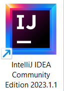

# Projecte **```Springboot-Hibernate```**

</img>

## [**1.** Instalació IntelliJ IDEA](./install-intelliJ-IDEA.md)


## [**2.** Creació del projecte](./creacio-projecte.md)


<!--
https://www.youtube.com/watch?v=7vHzVN0EiQc
https://mediamodifier.com/svg-editor

# Curso-de-Springboot-Hibernate
Curso de Java Fullstack (Springboot, Hibernate y JWT Session)

Si tienes interés en dominar Java Web Services con Spring Boot o en desarrollar API RestFUL a nivel empresarial, Udemy tiene un curso para ti.

Acceso al Curso completo: https://www.youtube.com/watch?v=7vHzVN0EiQc

Ayúdame a seguir creciendo, te invito a suscribirte: 

👉 Youtube: http://bit.ly/LucasMoy


Puedes encontrarme también en:

🔹 Instagram: https://www.instagram.com/lucasmoy.dev/

🔹 Facebook: https://www.fb.com/lucasmoy.dev/

🔹 Twitter: https://twitter.com/lucasmoy_dev/
 -->
