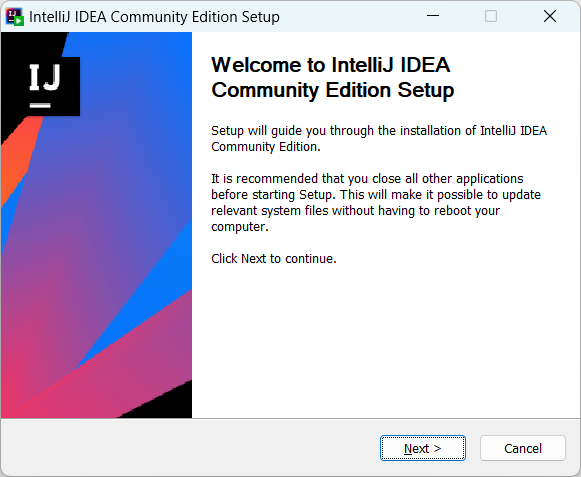
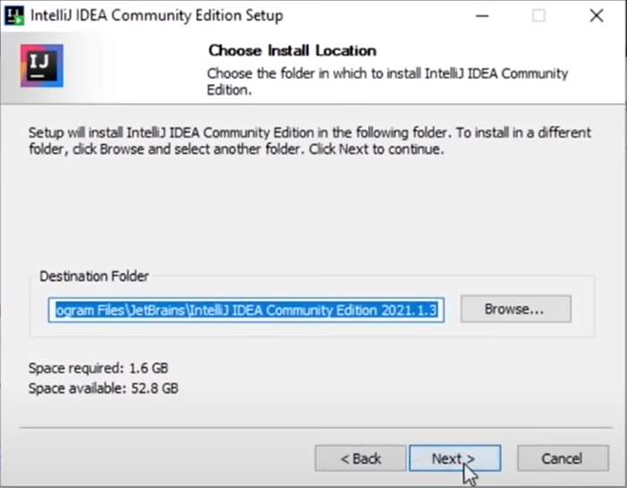
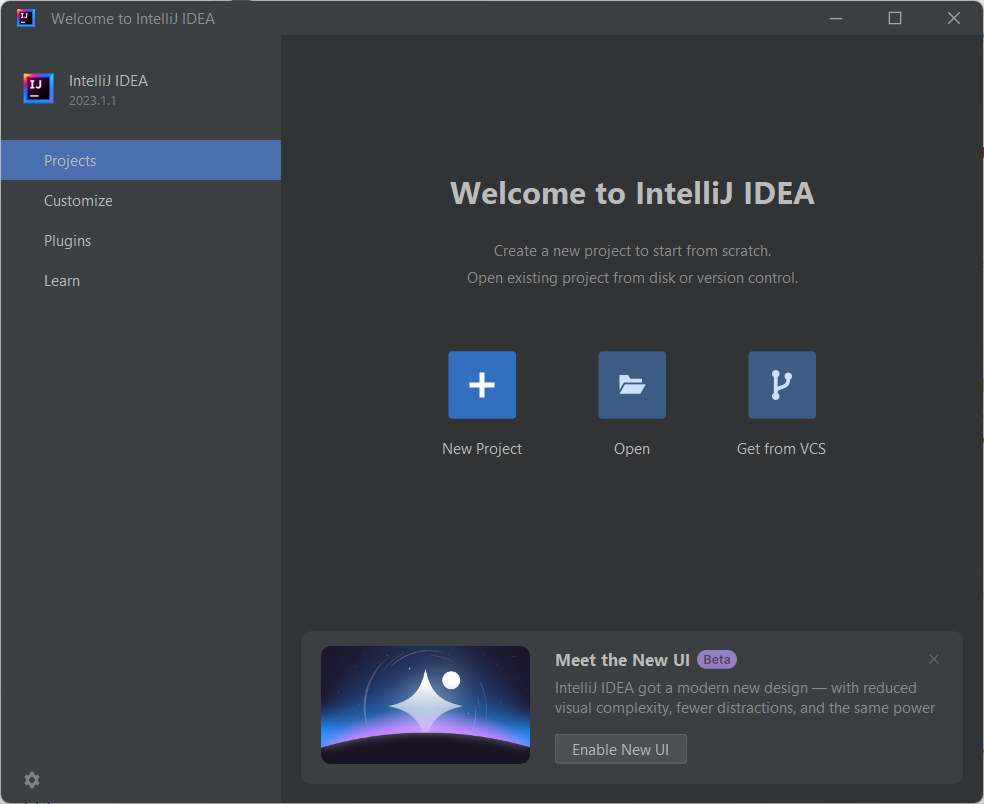

# **1.** Instal·lació **IntelliJ IDEA**  

### **IntelliJ IDEA** – the **Leading Java** and Kotlin IDE
#### The **IDE** that makes development a more productive and enjoyable experience

</img>

[**Download IntelliJ IDEA**](https://www.jetbrains.com/idea/download/)
* Community Edition
* The IDE for pure Java and Kotlin development

#### Copia aquest fitxer [**```ideaIC-2023.1.1.exe```**](./fitxers/ideaIC-2023.1.1.exe)
* Mida del fitxer ```633 MB (663.963.584 bytes)```

#### O fes servir aquest enllaç de descàrrega directe [Use the direct link **```ideaIC-2023.1.1.exe```**](https://download.jetbrains.com/idea/ideaIC-2023.1.1.exe?_gl=1*1k8vect*_ga*MTg2MTY5NjQ4LjE2Nzk5Mzk4Njc.*_ga_9J976DJZ68*MTY4Mjg3MzkwNy4yLjEuMTY4Mjg3Mzk0MC4yNy4wLjA.&_ga=2.48120163.554094189.1682873907-186169648.1679939867)


## Instal·lació  IntelliJ IDEA

### **1.** Executa el fitxer **```ideaIC-2023.1.1.exe```**.


### **2.** Pitja el botó **següent** (<code> <b><u>N</u>ext ></b> </code>) per continuar,


### **3.** No cal, però si vols pots modificar la ruta (<code> <b> B<u>r</u>owser...</b></code>), i si no, pitja el botó **següent** (<code> <b><u>N</u>ext ></b> </code>) per continuar,


### **4.** Assegura't que estàn marcades les segünents opcions:

> #### **Create Desktop Shortcut**
> 
> - :white_check_mark: IntelliJ IDEA Community Edition
> 
> ####  **Update Context Menu**
> 
> - :white_check_mark: Add "Open Folder as Project"
>  
> ####  **Update ```PATH``` Variable (restart needed)**
> 
> - :white_check_mark: Add "**```bin```**" folder to the > **```PATH```**
> 
> ####  **Create associations**
> 
> - :white_check_mark: **```.java```**

Quan estiguin totes aquestes opcions marcades, pitja el botó **següent** (<code> <b><u>N</u>ext ></b> </code>) per continuar,

> ## **NOTA**: Pot ser que no estiguin exactament aquestes opcions!


 pitja el botó **Install** (<code><b><u>I</u>nstall</b> </code>) per començar la instal·lació.
<!--  


 -->


### **4.** Marca l'opció ***I want to manually reboot later***, i recorda que cal reiniciar l'equip abans de que funcioni la instal·lació:

> :radio_button: **```I want to manually reboot later```**

 i pitja el botó **Finish** (<code><b><u>F</u>inish</b> </code>) per començar la instal·lació.


Si tot ha anat correctament, s'ha creat la següent icona a l'escriptori,

</img>

i l'aplicació es troba a la següent carpeta:
```"C:\Program Files\JetBrains\IntelliJ IDEA Community Edition 2023.1.1\bin\idea64.exe"```

Abans d'obrir l'aplicació, recordem que cal reiniciar l'ordinador.

Ja podem obrir l'aplicació **```IntelliJ IDEA```**

</img>


Només començar, apareiex la següent finestra **IntelliJ IDEA User Agreement** (***Acord d'usuari d'IntelliJ IDEA***)


Marquem l'opció **```I confirm that I have read and accept the terms of this User Agreement```** i pitjem el botó **següent** (<code> <b> Continue </b></code>) per continuar,


A continuació apareiex la finestra **Data sharing** (***Compartició de dades***)
El text que apareix diu:

> Ajudeu a JetBrains a millorar els seus productes enviant dades anònimes sobre les funcions i els connectors utilitzats, la configuració de maquinari i programari, estadístiques sobre tipus de fitxers, nombre de fitxers per projecte, etc. Tingueu en compte que això no inclourà dades personals ni cap informació sensible, com ara codi font, noms de fitxers, etc. Les dades enviades compleixen la Política de privadesa de JetBrains.

En aquest punt cadascú és lliure de compartir la seva informació o no.

Ara ja tenim l'aplicació oberta i funcionant correctament, amb la següent pantalla:



En contra del que qualsevol pensaria, NO crearem el projecte des de l'opció New Project, ja que al crear un projecte genèric, el crea amb una estrucutgra molt reduïda, i nosaltres voldrem començar amb un projecte que ja cotingui una pila de llibreries que farem servir.


### **Següent pas ...**
## [**2.** Creació del projecte](./creacio-projecte.md)
