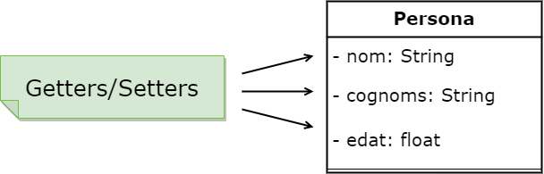
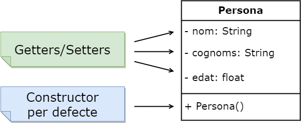
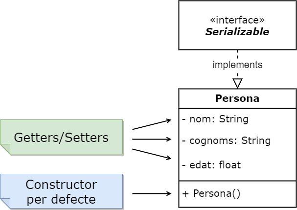

# Què és un Java Bean?

Un **Java Bean** és un estàndard que fa referència a la *definició de classes* de negoci amb uns *requisits concrets*. Veurem quins són aquests requisits que estem obligats a complir.

## **1.** **Propietats privades** amb mètodes **```Getters```** i **```Setters```** .

Aquest és un dels primers requeriments:
1. totes les propietats són privades i s'hi accedeix a través de Getters i Setters.



## **2.** Ha de tenir un **```constructor```** **públic** sense paràmetres.

Aquest és un dels temes que més maldecaps dóna als desenvolupadors a l'hora de confirmar que alguna cosa és un Java Bean.


Si per exemple es disposa de la classe **```Persona```** i té un **```constructor```** com:

```java
    public Persona (String nom, String cognoms, int edat) { } 
```

Això no ho converteix en **JavaBean** ja que **NO** és un **```constructor```** sense paràmetres.

Tampoc el converteix en **JavaBean** el següent:
```java
    Persona() { } 
```

Ja que el constructor **NO** és **públic**, perquè sigui un **JavaBean** ha de disposar del següent constructor:

```java
    public Persona() { } 
```

Això automàticament el converteix en un **JavaBean**.


## **JavaBean** i **Constructors** per defecte

Hem de recordar que tota **classe** **```Java```** que no disposi d'un **```constructor```** el **compilador** afegeix un **constructor per defecte**. Per tant, si tenim una classe sense constructor però amb els mètodes **Getter** i **Setter** correctament construïts si encaixarà com un **JavaBean**. Què més ens cal perquè la classe pugui ser considerada un **JavaBean**?

## **JavaBean** i **Implementar Serialitzable**

Perquè una classe es consideri un **JavaBean**, ha d'implementar la ***interfície Serialitzable***.



La interfície Serialitzable és una interfície de marca que no conté cap mètode però que permet que els objectes siguin serialitzables a disc o a xarxa.

```java
    public class Personas implements Serializable
```

Recordem que no cal que ho implementi ella mateixa sinó que també ho pot implementar una classe Pare.

Per tant, resumint molt la classe Persona és un JavaBean si és implementada d'aquesta manera:

```java
package com.teoria;

import java.io.Serializable;

public class Persona implements Serializable{

  private String nom;
  private String cognom;
  private int edat;
  
  public String getNom() {
    return nom;
  }
  public void setNome(String nom) {
    this.nom = nom;
  }
  public String getCognom() {
    return cognom;
  }
  public void setCognoms(String cognoms) {
    this.cognoms = cognoms;
  }
  public int getEdat() {
    return edat;
  }
  public void setEdat(int edat) {
    this.edat = edat;
  }
  public Persona(String nom, String cognoms, int edat) {
    super();
    this.nom = nom;
    this.cognoms = cognoms;
    this.edat = edat;
  }
  public Persona() {
    super();
  }
  
}
```