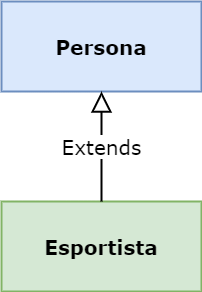

# Java Constructors **```this()```** i **```super()```**.

A **Java** es creen objectes cada dia i per crear-los es fan servir **constructors**.
Suposem que tenim la classe següent:

```java
package com.teoria;
 
public class Persona {

    private String nom;
    
    public String getNom() {
    return nom;
    }
    
    public void setNom(String nom) {
    this.nom = nom;
    }
}
```

## Java Constructors per defecte

Aquesta **classe** té algun **```constructor```**?

La resposta és **SÍ** qualsevol **classe Java** que no se li inclogui cap constructor, el compilador afegeix un constructor per defecte. Així doncs, el codi per al compilador seria el següent:

```java
package com.teoria;
 
public class Persona{

    private String nom;
    
    public Persona() {
    }

    public String getNom() {
    return nom;
    }
    
    public void setNom(String nom) {
    this.nom = nom;
    }
}
```

Com veiem per al compilador hi ha un constructor per defecte buit. Ara bé i si el codi de la nostra classe inclogués un constructor amb un paràmetre?


```java
package com.teoria;
 
public class Persona{

    private String nom;
    
    public Persona(String nom) {
        this.nom = nom;
    }

    public String getNom() {
    return nom;
    }
    
    public void setNom(String nom) {
    this.nom = nom;
    }
}
```
En aquest cas, Java no afegeix el constructor per defecte. Així doncs, en tots dos casos tenim un únic constructor.

## Java constructors i super()

Els dubtes amb els constructors apareixen lligats a les jerarquies de classes ia la paraula super() . Suposem que tenim la següent jerarquia:


En aquest cas podem tenir dues classes amb el codi següent per simplificar al màxim:




```Persona.java```

```java
package com.teoria;
 
public class Persona{
    
    private String nom;
 
    public String getNom() {
        return nom;
    }
 
    public void setNom(String nom) {
        this.nom = nom;
    }
}
```

```Esportista.java```
```java
package com.teoria;
 
    public class Esportista extends Persona{
        
        }
```

Encara que en el codi no apareguin constructors hi ha dos constructors per defecte un a cada classe (Persona,Esportista) amb el codi següent:

```Persona.java```
```java
public Persona() {
    super();
}
```

```Esportista.java```
```java
public Esportista() {
    super();
}
```

Com podem veure tots els constructors anomenen per defecte el constructor de la classe superior mitjançant una crida a super() (en aquest cas el constructor per defecte). Això és degut a que els constructors no s'hereten entre jerarquies de classes. Per tant, la paraula super() sempre és la primera línia d'un constructor i invoca el constructor de la classe superior que comparteixi el mateix tipus de parametrització.